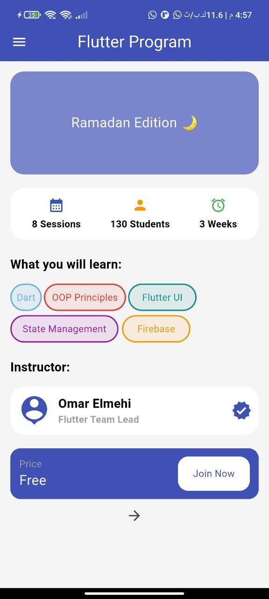
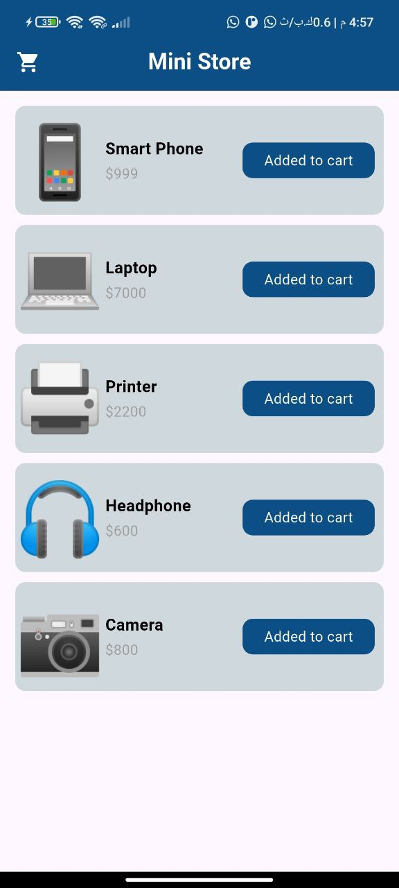

# Flutter First App

A simple Flutter project built as the first implementation during an intensive Flutter course.

## 📱 Features

- Two screens app:
    - **Program Screen**: displays course/program details like number of sessions, duration (weeks), and covered topics.
    - **Mini Store Screen**: shows a basic list of products with names and prices.
- Simple navigation between screens.

## 🧭 Screens

- `flutter_program.dart`: Program details screen.
- `mini_store.dart`: Simple product listing screen.

## 🔄 Navigation

A button on the Program screen navigates to the Mini Store screen.

## 🛠 Tech Stack

- Flutter
- Dart

## 🎯 Purpose

This project was created as a beginner-level Flutter exercise to practice:
- Multi-screen apps
- Basic UI layout
- Navigation between screens

## 📸 Screenshots

### Program Screen

### Mini Store Screen

---
